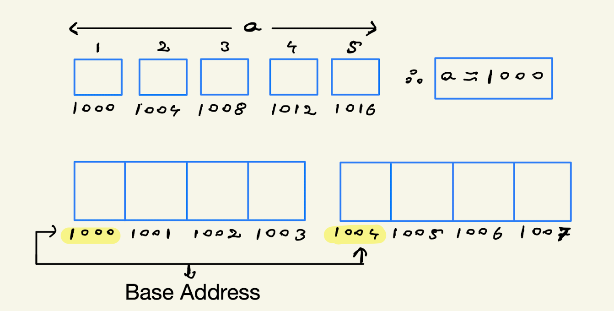
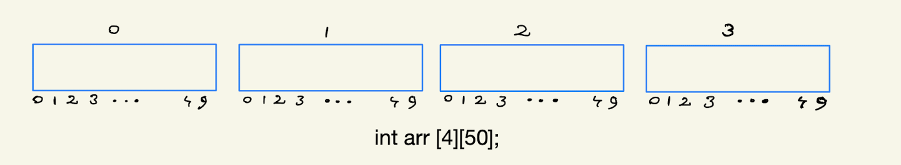
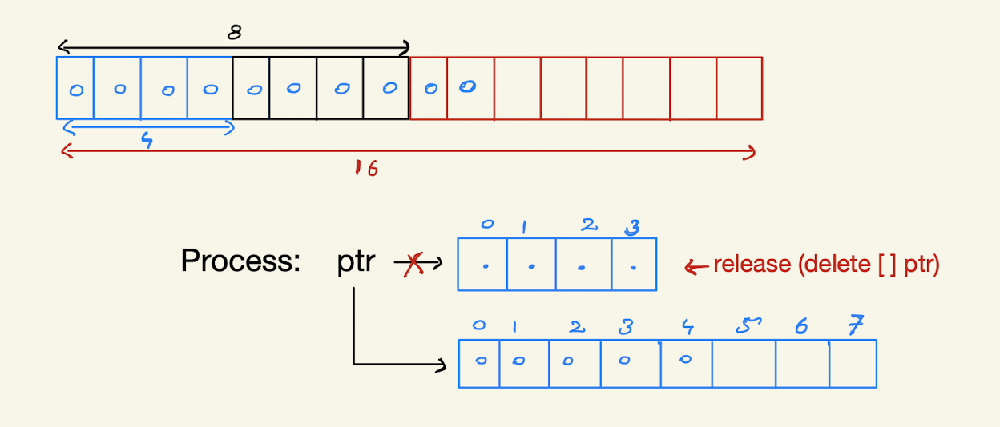
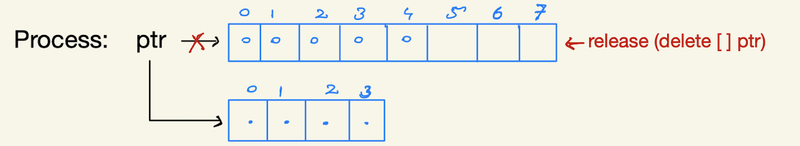

# Arrays
- Array is a linear collection of similar elements.
- Array elements are indexed.
- The name of the array is treated as constant which represents first byte's address of the array.
- `[]` is called the subscript operator.
- `a[]` = `*(a+i)`
  

  
- `a` -> it's not a variable, it's a constant. Containging address of 1st byte **[Base Address]**.
- `a[2]` = `*(a+2)` = `*(1000+2)` = `*(1008)` = `a[2]`
- Accessing Array elements is fast, **O(1)** time.
- It takes constant time to access any item of array if index is known.
    - `int arr[10000];`
    - `arr[9999]; -> *(arr+9999) ` //constant time
    - `arr[0] -> *(arr+0) ` //constant time
    - `arr[10] -> *(arr+10) ` //constant time

**Q)** When to use an array?
- Whenever group of related data is needed to be stored. When data is stored in group of groups, we prefer 2D-Arrays.
  

  
---

# Dynamic Arrays
**"** A dynamic array, growable array, resizable array, mutable array, or array list is a random access, variable-size list data structure that allows elements to be added or removed. It can `grow or shrink` accordingly when some constraints are met.**"**
- `double_array()`: You are trying to insert or append data in an array & the array is full. The `scheme` to be followed here is to double the size of array, when maximum capacity is reached.
  

  
- `half_array()`: After successfull deletion of data from the array, if the array is `half-filled` then call `half_array()`. The `scheme` applied here is to half the size of array when condition is met.
  

  
- **`Advanatages of dynamic Arrays:` [vectors in c++]**
    - Dynamic Size
    - Rich library functions (find, erasem insert, etc)
    - Easy to know size.
    - No need to pass size.
    - Can be returned from a function.
    - Can be initialized with default values.