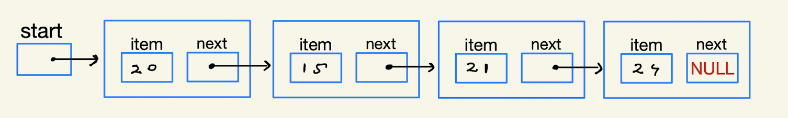
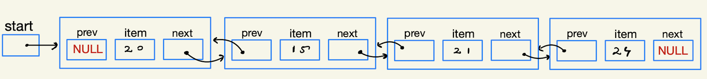

## Q. What is a List?
"`List` is a linear collection of data items also known as List Items." **Eg:**
- Marks of Tests:<br>20, 15, 21, 24, 18, 23... `(int type)`
- List of guests:<br>"Singh", "Chaturvedi", "Dubey"... `(string/char [] type)`
- List of Students:<br>[Rahul, 17, xyz@x.com], [Savita, 19, xy@x.com], [Dilip, 18, x@x.com]... `(class/Struct type)`

# Singly Linked-List (SLL)
<br><br>

<br>
```c++
Struct node{
    int data;
    node *next;
}
```

**`NOTE:`** The nodes are `logically` linear, not `physically`.

**`Insertion:`**
- **Starting**
- **Last**
- **After a node**

**`Deletion:`**
- **First node**
- **Last node**
- **Specific node**

```c++
void addFirst(int item){
    node *newNode = new node(item);
    newNode->next = start;
    start = newNode;
}
```
```c++
void addLast(int item){
    node *newNode = new node(item);
    if(isEmpty()){
        start = newNode;
        return;
    }
    node *temp = start;
    while(temp->next)
        temp = temp->next;
    temp->next = newNode;
}
```
```c++
void addAfter(node *ptr, int item){
    if(ptr==NULL)
        return;
    node *newNode = new node(item);
    newNode->next = ptr->next;
    ptr->next = newNode;
}
```
```c++
void deleteFirst(){
    if(isEmpty())
        return;
    node *del = start;
    start = start->next;
    delete del;
}
```
```c++
void deleteLast(){
    if(isEmpty())
        return;
    if(start->next==NULL){
        delete start;
        start = NULL;
        return;
    }
    node *temp = start;
    while(temp->next->next)
        temp = temp->next;
    delete temp->next;
    temp->next=NULL;
}
```
```c++
void deleteNode(node *ptr){
    if(isEmpty())
        return;
    if(ptr==start){
        deleteFirst();
        return;
    }
    node *temp = start;
    while(temp->next!=ptr)
        temp = temp->next;
    temp->next = ptr->next;
    delete ptr;
}
```
### Advantages of Linked-List:
- It's a `dynamic Data-Structure` i.e. memeory is only used when required & released when not required.
- Insertion and deletion is easy & it doesn't require shifting of elements like arrays.

### Shortcomings of Linked-List:
- In SLL you can only move in forward direction.
<br><br>

# Doubly Linked-List
<br><br>

<br>
```c++
Struct node{
    int data;
    node *prev;
    node *next;
}
```

**`Insertion:`**
- **At First**
- **At Last**
- **After a node**

**`Deletion:`**
- **First node**
- **Last node**
- **Specific node**