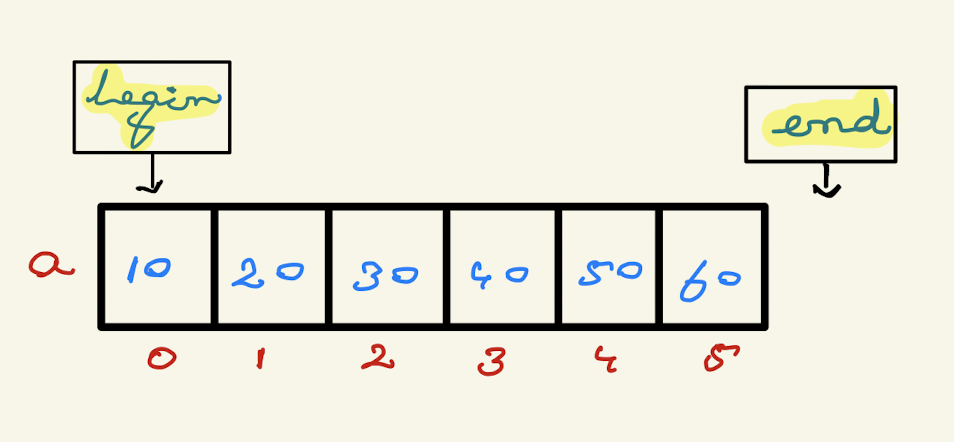
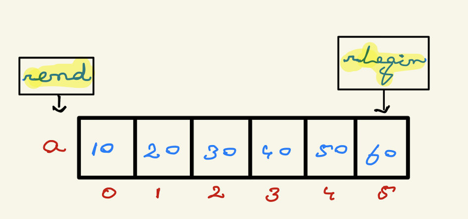

# Vector
- Vector is a sequential Container.
- Vector allows random access via `[]`.
- `Vector` is implemented using `Dynamic Array` Data-Structure.
- Header file: `#include <vector>`.
## How to create an vector object?
```c++
vector <int> v1{10, 20, 30};
vector <int> v2;  // capacity is 0
vector <int> v3(n, 0);  // n size with all values 0
vector <int> v4 = v2;
vector <int> v5(arr, arr + n);  // n is size of array
```
## Accessing vector elements
- `[]` - no bound checking.
- `at()` - bound checking.
```c++
vector <int> v1 = {50, 40, 30, 20, 10};
cout<<v1[5];    // prints garbage
cout<<v1.at(5)  // throws an exception of out_of_range
```
- `Implicit Iterator`
```c++
vector <int> v = {50, 40, 30, 20, 10};
for(auto x:v)
    cout<<x<<", ";
```
- `Explicit Iterator`
Iterator objects can be obtained from the following members of array class:
    - `begin()/end()` - iterator (**read/write**)
    - `cbegin()/cend()` - const_iterator (**read only**)
    - `rbegin()/rend()` - reverse_iterator (**read/write**)
    - `crbegin()/crend()` - const_reverse_iterator (**read only**)
<br><br>


<br><br>

```c++
vector <int> v{10, 20, 30, 40, 50, 60};

vector <int>::iterator it;
for(it=v.begin(); it!=v.end(); it++)
    cout<<*it<<", ";
//output: 10, 20, 30, 40, 50, 60

vector <int>::const_iterator c_it;
for(c_it=v.cbegin(); c_it!=v.cend(); c_it++)
    cout<<*c_it<<", ";
//output: 10, 20, 30, 40, 50, 60

vector <int>::reverse_iterator r_it;
for(r_it=v.rbegin(); r_it!=v.rend(); r_it++)
    cout<<*r_it<<", ";
//output: 60, 50, 40, 30, 20, 10

vector <int>::const_reverse_iterator c_r_it;
for(c_r_it=v.crbegin(); c_r_it!=v.crend(); c_r_it++)
    cout<<*c_r_it<<", ";
//output: 60, 50, 40, 30, 20, 10
```
## Other Important methods of vector class
- `fill(v.begin(), v.end(), value)` - specially used to initialize or fill all the indexes of the vector with a similar value.
- `begin()` - returns an iterator pointing to  the first element of the list.
- `end()` - returns an iterator pointing to the theoretical last element which follows the last element.
- `back()` - returns last element.
- `front()` - returns first element.
- `empty()` - returns true or false.
- `data()` - returns a direct pointer to the memory array used internally by the vector to store its owned elements.
- `size()` - returns number of elements in vector.
- `max_size()` - eeturns the maximum number of elements that the vector can hold.
- `capacity()` – Returns the size of the storage space currently allocated to the vector expressed as number of elements.
- `shrink_to_fit()` – eeduces the capacity of the container to fit its size and destroys all elements beyond the capacity.
- `push_back()` – It push the elements into a vector from the back.
- `pop_back()` – It pops or remove elements from a vector from the back.
- `emplace()` – It extends the container by inserting new element at position
- `emplace_back()` – It is used to insert a new element into the vector container, the new element is added to the end of the vector.
## **`insert()`** in vector
Insert one or more elements.
- `v.insert(it, element)` - insert single element before the element specified by `it`.
- `v.insert(it, frequency, element)` - insert a element multiple times before the element specified by `it`.
- `v.insert(it, {e1, e2, e3...})` - insert few elements before the element specified by `it`.
- `v2.insert(v2.begin(), v1.begin(), v1.begin()+5)` - copy first 5 elements of v1 into v2.
## **`erase()`** in vector
- `v.erase(it)` - erase an element of vector.
- `v.erase(it1, it2)` - erase a range of elements of vector (*it1* is inclusive and *it2* is exclusive).
## `emplace()` vs `insert()`
- Both are used to add elements in vector.
- `emplace()` avoids unneccessary copy of object, thus it is efficient.
- For primitive types it does not matter which type you use to add elements in vector but for objects, use `emplace()` for efficiency.
- `emplace()` is superior to `insert()`.